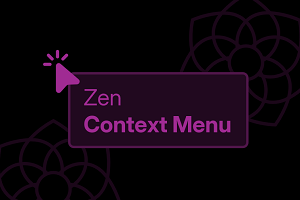

# Zen Context Menu

> [!NOTE]
> This is a fork of **Zen Context Menu** by [KiKaraage](https://github.com/KiKaraage), from the [Zen theme store](https://zen-browser.app/mods/81fcd6b3-f014-4796-988f-6c3cb3874db8) ([source](https://github.com/zen-browser/theme-store/tree/main/themes/81fcd6b3-f014-4796-988f-6c3cb3874db8), [author's repository](https://github.com/KiKaraage/ZenMods)). All credit for the mod and its idea goes to them. This fork keeps it working with current Zen releases (checked against **Zen 1.22.3b**, Firefox 156). Compared to v3.1 in the store:
>
> - The tab context menu no longer hides **Duplicate Tab** or **Move Tab** by default. Zen lists your other spaces under Move Tab, so it was the only way to move a tab to another space ([KiKaraage/ZenMods#55](https://github.com/KiKaraage/ZenMods/issues/55)).
> - Items are matched by id instead of by position, so a Zen or Firefox update no longer makes options hide the wrong items or leave separators stacked on top of each other ([KiKaraage/ZenMods#54](https://github.com/KiKaraage/ZenMods/issues/54)).
> - Options that did nothing now work: **Select All Tabs** ([KiKaraage/ZenMods#63](https://github.com/KiKaraage/ZenMods/issues/63)), **Unload Tab**, **Ask AI chatbot**, **Apply space gradient** ([KiKaraage/ZenMods#64](https://github.com/KiKaraage/ZenMods/issues/64)) and **Prioritize Copy Clean Link**. **Bookmark Tab**, **Move Tab** and **Close Multiple Tabs** have their own options again instead of only being hidden by the reorder option.
> - **Restore icons** draws each icon in the menu's own icon slot, so icons no longer overlap labels like "Copy" ([KiKaraage/ZenMods#56](https://github.com/KiKaraage/ZenMods/issues/56)) and every icon exists in current Zen.
> - New options for items Zen and Firefox added since: New Tab Below, Move to Folder, Change Label/Icon, Add Route for Domain, Open Link in Glance/Split Link, Copy Link to Highlight and Google Lens.
>
> See the [changelog](CHANGELOG.md) for details.

Declutter your right click menus: hide the options you don't need, reorder the tab context menu, and optionally bring back icons or give menus your space's colors.



## What it can do

- Reorder the tab context menu: tab actions first (split view, mute, Essentials, pin, unload, duplicate), then moving and organizing (folders, other spaces, containers), then everything else, then closing _(on by default)_
- Hide all separators
- Hide the icons in context menus (extension items, containers...), except checkboxes and radio buttons
- Restore icons for context menu options, like Zen had them before 1.12.9b
- Apply your space's gradient or accent color to menus, tab previews and other small pop-ups
- Show "Copy Clean Link" instead of "Copy Link" when it would remove tracking parameters, and only "Copy Link" when there's nothing to remove _(on by default)_
- Hide these options:
  - Tabs: Bookmark Tab _(on by default)_, Mute Tab, New Tab Below, Move Tab, Move to Folder, Open in New Container Tab, Send Tab to Device, Close Tab & Close Duplicate Tabs, Close Multiple Tabs _(on by default)_, Select All Tabs _(on by default)_, Reload Tab _(on by default)_, Duplicate Tab, Unload Tab, Change Label & Change Icon, Add Route for Domain, Pin Tab & Add to Essentials
  - Pages: Back/Forward/Reload/Bookmark Page buttons, Save Page As, Send Page to Device, Take Screenshot, View Page Source & Inspect, This Frame
  - Links: Bookmark Link _(on by default)_, Save Link As, Open Link in New Container Tab, Send Link to Device, Open Link in Glance & Split Link to New Tab
  - Selected text: Search, Search in a Private Window _(on by default)_, Translate Selection, Ask AI chatbot, Print Selection _(on by default)_, Select All _(on by default)_, Copy Link to Highlight
  - Images and media: Email Image, Set Image as Desktop Background & View Image Info, Search Image with Google Lens, Copy/Email Video & Audio Link
  - Text fields: Check Spelling, dictionaries and text direction

## Installation

Use one copy of the mod at a time: if you have **Zen Context Menu** from Zen's mod store installed, remove it first. This fork uses the same settings, so your choices carry over.

### Sine

1. Install [Sine](https://github.com/CosmoCreeper/Sine) if you haven't already.
2. In Sine's mod manager, add a mod from a repository and enter:
   ```
   sinazadeh/Zen-Context-Menu
   ```
3. Open the mod's settings (gear button) once, even if you keep the defaults: Sine applies the options that are on by default when the settings are first shown.

### Manually

1. In `about:config`, set `toolkit.legacyUserProfileCustomizations.stylesheets` to `true`.
2. Copy `chrome.css` into your profile's `chrome` folder (`about:support` → Profile Folder → Open Folder) and add `@import "chrome.css";` at the top of `chrome/userChrome.css` (create it if needed).
3. Turn options on in `about:config`: create a boolean for each option you want, using the names in [`preferences.json`](preferences.json) (for example `uc.fixcontext.ergonomicsfortabs`). Options that are on by default in the mod managers need to be created by hand here too.
4. Restart Zen.

### macOS

macOS uses native context menus, which mods can't style. Uncheck the first option (or set `widget.macos.native-context-menus` to `false` in `about:config`) to use Zen's own menus instead, and turn it back on before removing the mod.

## Settings

With Sine, click the gear button of **Zen Context Menu**. Options apply right away. Every option is a boolean preference in `about:config`; see [`preferences.json`](preferences.json) for the full list with descriptions.

If an option stops doing anything after a Zen update, please [open an issue](https://github.com/sinazadeh/Zen-Context-Menu/issues) with your Zen version (`about:support`) and the option's name.

## Development

This is a plain CSS mod with no build step: `chrome.css` is the mod, `preferences.json` its settings and `theme.json` the manifest Sine reads. Every week, CI checks that everything it points at still exists in the latest Zen and opens the real menus in it with each option on. See [CONTRIBUTING.md](CONTRIBUTING.md) for the checks to run and [AGENTS.md](AGENTS.md) for how the mod is put together and how to keep it working when Zen changes.

## Credits and license

Zen Context Menu was created by [KiKaraage](https://github.com/KiKaraage) ([KiKaraage/ZenMods](https://github.com/KiKaraage/ZenMods)), including the preview image. This fork is maintained by [sinazadeh](https://github.com/sinazadeh). Both are released under the [MIT License](LICENSE).

[shanx/ZenMods](https://github.com/shanx/ZenMods) is another community fork of the mod, if you'd like to compare.
